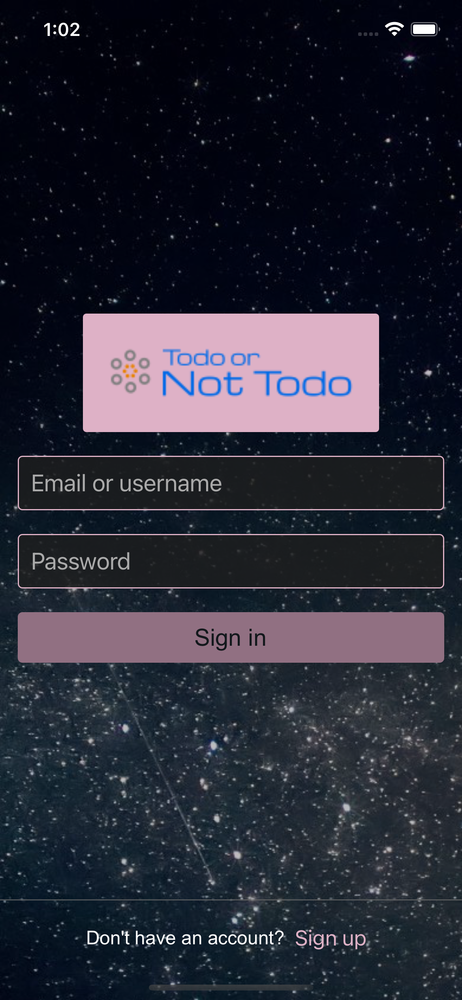
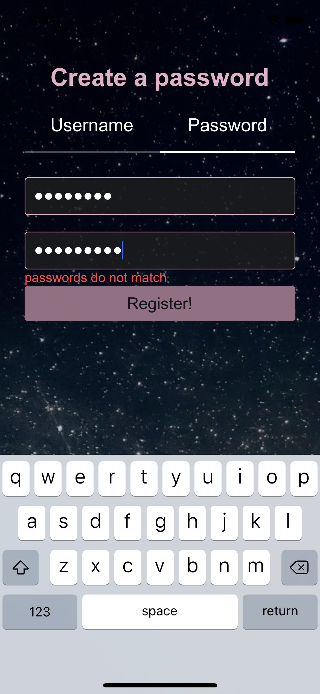

<a href="https://expo.io/@perry-olsson/todo-or-not-todo"><h1 align="center">Todo or Not Todo</h1></a>

---

---

<h5 align="center">Can be ran using the Expo app <a href="https://expo.io/@perry-olsson/todo-or-not-todo">here</a></h5>

<h5 align="center"></h5>

<h5 align="center">iOS preview: <a href="https://appetize.io/embed/tva4n5vv04cjvq1c9g7582jbjr">https://appetize.io/embed/ynp0qcfphh663b67hhgzk28yfm</a></h5>

<h5 align="center">Android preview: <a href="https://appetize.io/embed/m0n8avntfr8n3pj61tch27fjr0">https://appetize.io/embed/m0n8avntfr8n3pj61tch27fjr0</a></h5>

## Project Status -- ON HOLD

This was originally an impromtu collaboration with a friend whose education was put on hold via the pandemic in the attempt to build a social/event planning application. I built the account creation and authentication and ended up with an application you could register and log into just to find a blank page. I wanted at least something to show for, so I spent a few days building a todo app.

In the future I plan on scrapping the todo portion and creating a subscription management application in its place.

## Feature Overview

- React Native application (functioning builds for both Android and iOS)
- Account creation/authentication with server and client side validation.
- Persistant sessions
- Email account confirmation using SMTP
- Create and delete persistant todo items with bulleted notes
- Account deletion
- Loading display module that targets individual components

## Run Locally

1. clone the repo
2. install <a href="https://docs.expo.io/get-started/installation/">Expo</a> if needed.

#### Api setup

- With <a href="https://docs.docker.com/get-docker/">Docker</a> (recommended)

1. Run `npm install` in the API directory
2. Create a .env file following the template
3. Run `docker-compose up -d`
4. `npm run db:init`
5. `npx mikro-orm migration:up`
6. `npm run dev` OR `npm run watch` and `npm run dev:js` in a new terminal

#### Client set up

1. Run `npm install` in the Client directory
2. Create a .env file following the template
3. Run `npm run dev`

## Reflection

**TLDR** As mentioned above the project was originally a collaboration. I went into it with the mindset of creating an UX/UI focused application from start to finish. The collaboration did not end up working so I built a simple todo application with robust account creation, authentication, and email confirmation.

#### Inspiration

I had just finished the React Native section of an online course I was taking and was feeling fairly confident using it. Around that time I met someone at a party who was in their senior year at MIT. He had a very interesting idea for a social media application that was focused on facilitating actual meet ups and planning events. The application was going to require users to create accounts and authenticate so having had experience with that, I got started on it. The friend I had met ended up getting busy with school and the application at the point, just had users logging into a blank page, so I decided to create a light weight todo app.

#### Notable Technologies

- React Native
- Formik
- Postgresql
- Mikro-orm
- GraphQL with Apollo
- type-graphql
- Nodemailer
- Typescript

#### Challenges and Takeaways

Using React Native can definitely prove difficult at times. My biggest gripe was error messages and debugging. 80% of the errors point you to code that isn't yours and you are left to try and find the bug on intuition alone. Once you actually get it working though, being able to spit out two working applications for different operating systems is quite nice. Now I haven't had any experience using a different cross-platform framework, or building mobile application with their native tools, but if you're well versed in react, react native is still a good choice despite it's sore spots.

On the server side, the api was built with GraphQL and uses postgres to persist data. At first, it seemed like there was going to end up being duplicated types all over the place so I did some research and came across the type-graphql library. It ended up meshing incredibly well with Mikro-orm and saved me from any and all duplication of types. Both type-graphql and Mikro-orm allow the use of decorators within a typescript class to declare GraphQL types and schema respectively. The end result is a single class for each database entity that declares a typescript type, GraphQL type, and the schema for that table. Pure joy.

The backend was written in typescript right from the beginning as I had just recently began to use typescript and felt it was absolutely worth the extra overhead of creating and dealing with types. So much so that when I came back to the project after a couple of months away, I immediately integrated typescript with the react native application. The ease of migrating an application from javascript to typescript is incredible. It enables you to go at whatever pace you would like. You can write your new code with typescript and slowly migrate old files over as you see fit, all without breaking the application. In situations where the choice is mine, I don't think I could ever choose javascript again. The silly (and not silly) errors that static type checking catches for you end up saving you time in the long run, especially as an application grows. And who doesn't love autocomplete anyways.
